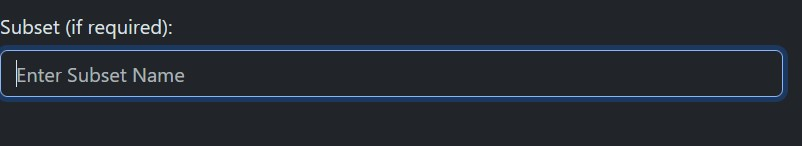

# turbo-broccoli

How to use the Turbo Brocoli webapp:

1) Ensure that you have all the necessary dependencies installed. The required dependencies can be found in the file: "projectEnvironmentSetup.bat"

2) Navigate to the correct folder in the repository called "frontEnd"
 
3) Run the following command in order to set up the locally hosted web app:\
*flask --app app run*\
This can be run with the "--debug" flag added to the end for easier code updating

4) Open the local host instance at *http://127.0.0.1:5000* in a web browser\
The following webpage should appear:\

5) Once on the webpage, the first step is to select a model.\
\
To enter a model, first find the model url from *huggingface.com* and input it into the text box and click *Retrieve Model"
\
\
You are then able to select the model from the drop down list next to the text box

6) The next step is to select a dataset. To do this, follow the steps from 5 but instead input the URL for the dataset

7) If the dataset that you want to run is a subset of the main dataset, you will need to enter the name of this subset in the box below the dataset selection

8) To fine tune how the model will e trained, a number of parameters can be adjusted based on a number of different factors

The options available include:
- The number of epochs to run
- The learning rate
- The option to limit the dataset
    - If set to *True*, this will automatically reduce the size of the database to 400 training samples, and 100 testing samples
    - For quicker testing it is recommended this is set to *True*, for full tests keep this false
- The per-device training batch size
- The per-device eval batch size
